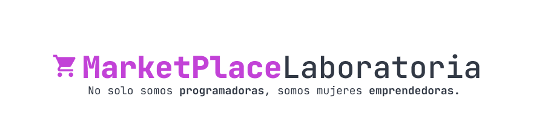

Idea para - **Web Dev Connection Day**
# ¿Qué es Marketplace Laboratoria? 
La tecnología es una herramienta que tiene el poder de unirnos, conectarnos y apoyarnos entre personas. MarketPlace Laboratoria es un espacio único donde no solo puedes comprar productos o creaciones auténticas de nuestras egresadas, sino también puedes vender tus creaciones si eres una de ellas.

No estás comprando solo un simple objeto, estás adquiriendo la chispa de pasión y amor con la que nuestras egresadas elaboran cada producto.

**En Laboratoria no solo somos programadoras con la energía necesaria para llevar a cabo cualquier proyecto, sino también mujeres emprendedoras con una creatividad que no tiene límites.** A pesar de la pandemia, seguimos creando y encontrando maneras innovadoras de generar ingresos y apoyar a nuestras familias.

**Este es el principio fundamental de MarketPlace Laboratoria, una comunidad brillante donde la tecnología y el espíritu emprendedor se unen para crear algo maravilloso.**

## ¿Por qué surge la idea? 💛
Conocí varias mujeres que hacían con sus propias manos productos para vender (tortas, tejidos, ilustraciones, entre otros), o que tenían emprendimientos en sus redes sociales. ¿Qué mejor forma que apoyarnos entre egresadas y no egresadas para impulsar el espíritu emprendedor de cada una?

## ¿Qué necesita hacer el usuario?
Solucionando el problema..

**Necesita ver** 👀
* El usuario debe poder visualizar una sección con promociones.
* El usuario debe poder visualizar una sección con la lista de productos.
* El usuario puede seleccionar un producto para poder ver los detalles del mismo. 

**Necesita Buscar** 🔍
* El usuario debe ser capaz de buscar y filtrar la lista de productos. 

**Necesita Comprar** 🛒
* Una vez registrado y con una sesión abierta, el usuario debe poder agregar productos a su carrito.

**Necesita Compartir** 🔗
* El usuario debe ser capaz de Compartir el producto en redes sociales

**Necesita Registrarse** 😀

* El usuario debe ser capaz de crear una cuenta (registrarse).
* El usuario debe ser capaz de ingresar a su cuenta (previamente generada) a partir de su correo electrónico y contraseña (login).

